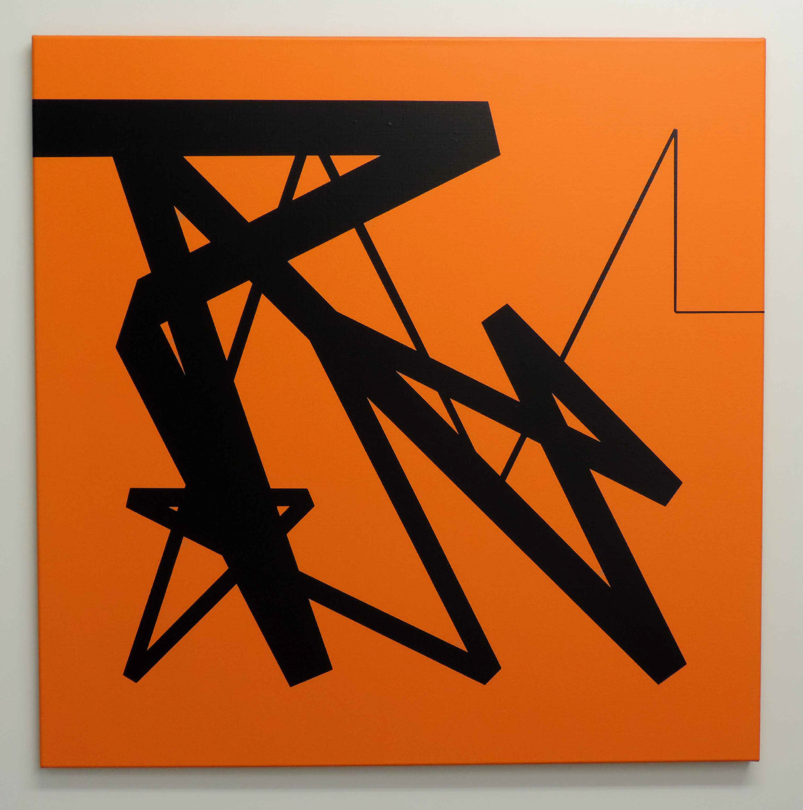
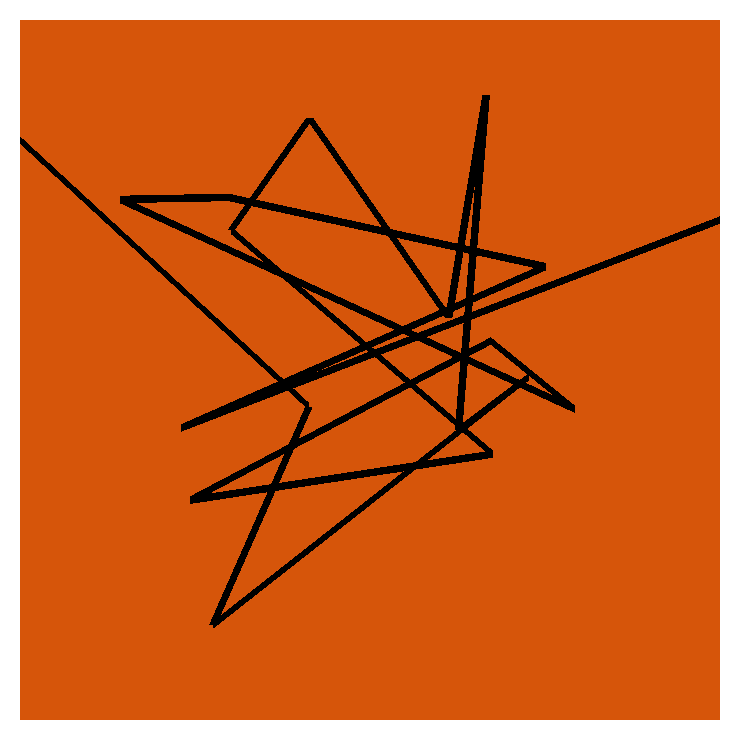
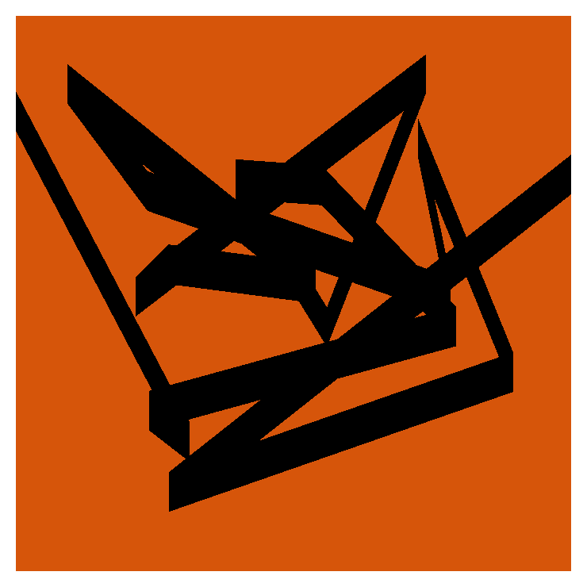
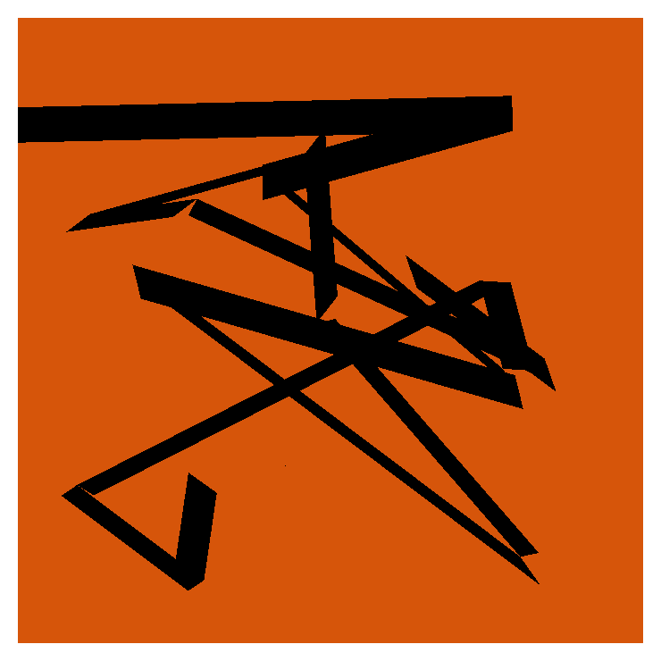
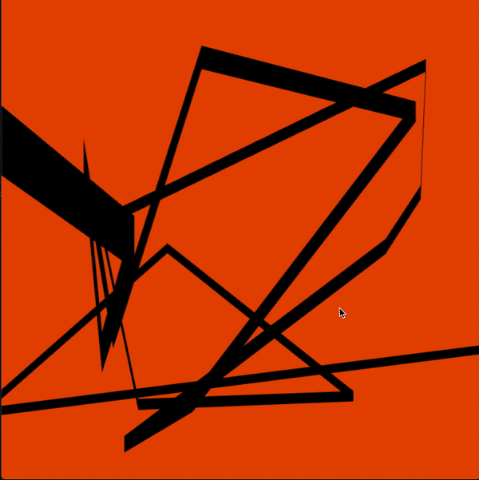
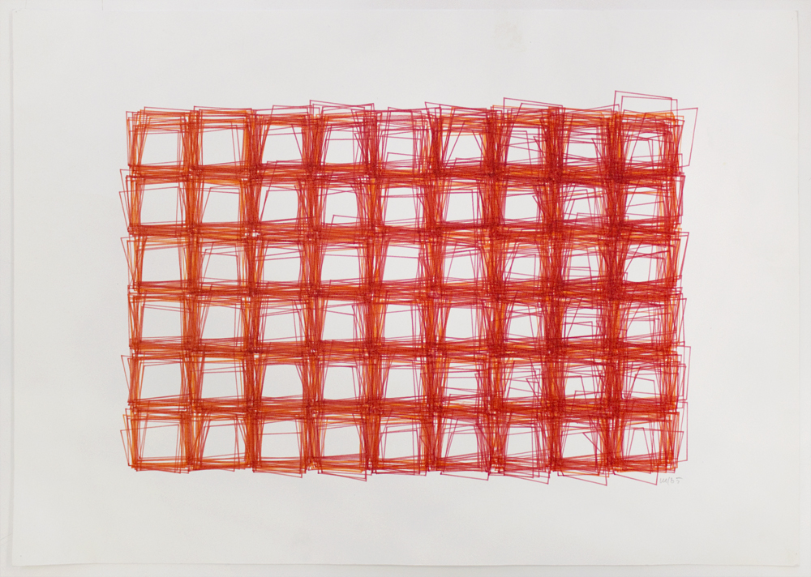
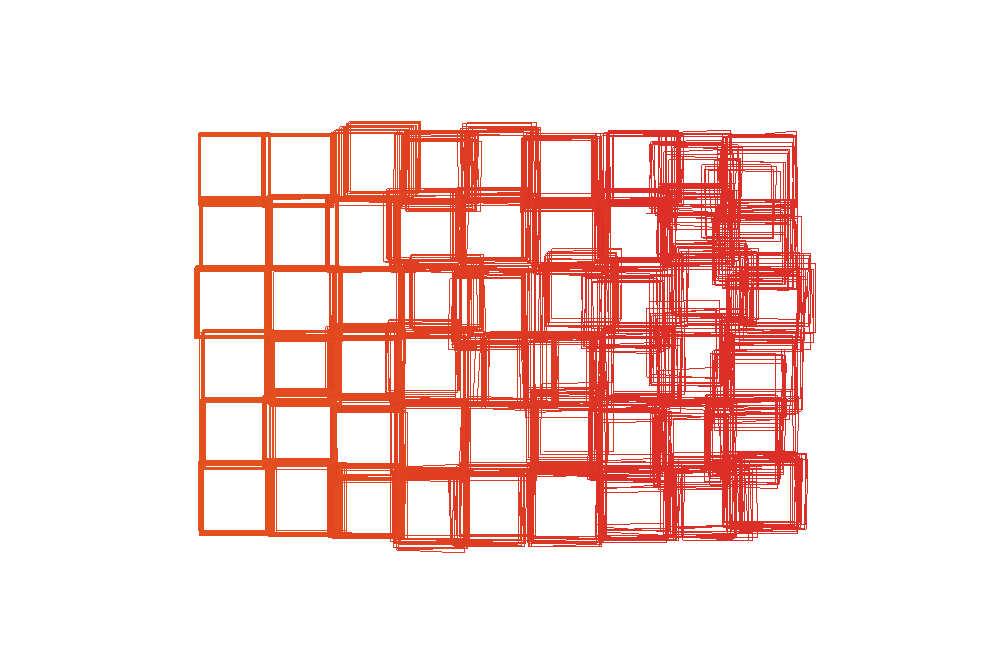
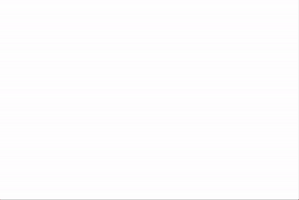

# ReVera

## MIT Media Lab - Recreating the Past - Class 1: Vera Molnar

The MIT Media Lab class - Recreating the Past - explores a number of influential artists who have, over the past century, added their own unique perspective on computational art. Each week focuses on a new artist and through exploring their view point and recreating their artworks I hope to gain a valuable window into their thought processes, helping me learn how to express my own opinions through computational art. 

## Vera Molnar 

This first week focuses on Vera Molnar, here is a except on Vera from the Kate Vass Gallery (https://www.katevassgalerie.com/blog/vera-molnar-pioneer-of-computer-art):

"Born in Hungary in 1924, Vera Molnar is one of the first women artists to use computers in her practice. 

Trained as a traditional artist, she studied art history and aesthetics at the Budapest College of Fine Arts and moved to Paris in 1947, where she still lives. She co-founded several pioneering artist research groups such as G.R.A.V. (Groupe de Recherche d'Art Visuel), which investigate collaborative approaches to mechanical and kinetic art, and the research group for art and computer science at the Institute of Art and Science in Paris. 

Pre-dating the computer, she invented algorithms or “machine imaginaire” that allowed the creation of image series following a set of pre-ordained compositional rules. Beginning in 1968, the computer became a central device in the making of her paintings and drawings, allowing her to more comprehensively investigate endless variations in geometric shape and line."

## Carre Magique

The first artwork I chose to focus on was one of Vera's newer works - Carre Magique - which really stood out to me due to the striking folded line effect and also the seeming randomness of the path. It immediately made me think about how the path might have some underlying structure or flow.

Here is the original and final recreation side by side: 

Original            |  Recreation
:-------------------------:|:-------------------------:
 |   

#### Process

To start with I utilized a simple path of lines and a random function to determine the location of each node. Due to limitation in line thickness however I moved to an approach using a vector of points and then drawing rectangles between the start and end of each point. The issues here however is that the boundaries between rectangles are tricky and the position of the rectangle corners are not obvious. I began with vertical offsets before moving onto angle calculations.

Finally to create the effect of the line diminishing in size through time i added a Z index and draw in 3 dimensions which with a 3D perspective gives the illusion of the line getting thinner. I did this to avoid adding even more complexity in sizing and positioning the rectangle corners.

 
 

## Vera Molnar - Untitled Squares

Secondly I chose to recreate a much older untitled piece. When i looked at this work i saw an accumulation from left to right where the noise and variation is ramped up across the image. In order to capture this effect i decided to animate and therefore draw each line individually rather than as squares (looking back probably a mistaken from a simplicity perspective!).

In the end the effect doesn't quite capture the same sense of noise as the original and the style of noise is also different. The recreation has a sense of wandering away from the center point which doesn't exist in the original.

Original            |  Recreation
:-------------------------:|:-------------------------:
  |  

In animated form this looks like:

